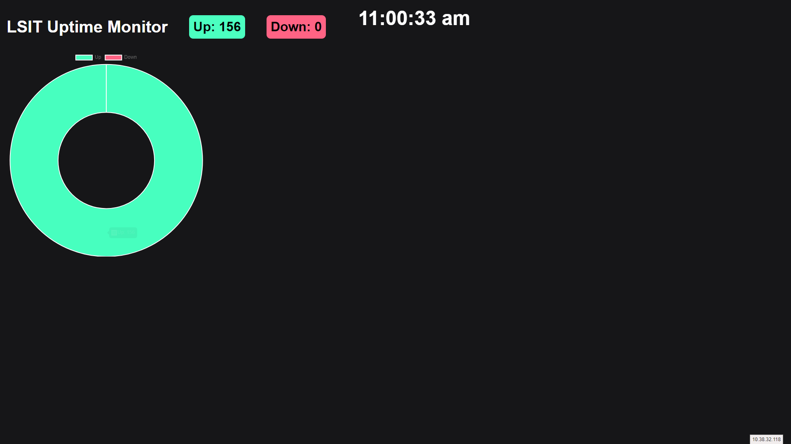

# LSIT Uptime Monitor

This website was designed to give us a monitor that would give us quick stats for all of our services on one page. The info is pulled from Uptime-Kuma then displayed to the user.

## Installation Instructions

This assumes that you already have installed Uptime-Kuma

1. Clone the git repository.
2. Edit the the crontab to run the python script. It will look something like this: ` * * * * * root python3 /home/byu.local/mgregg99/python-monitor/sqlmonitor.py`
3. Spin up the docker container with ` docker run -d -p 5000:5000 mgregg99/python-monitor `
4. If your docker container is running on a differnet server or a port other than 5000, you will need to edit the final line of the sqlmonitor.py script to point to the docker container.